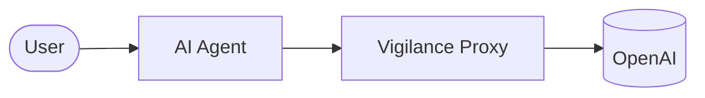

# 🛡️ Vigilance Operations: AI Agent Guardrail Proxy

<div align="center">
  <p><strong>Enterprise-grade observability, governance, and security proxy for autonomous AI agents.</strong></p>
  
  
  
  
  
</div>

<br />

Vigilance Operations sits securely between your autonomous agents and upstream LLM providers (e.g., OpenAI). It intercepts every interaction to enforce strict budgets, prevent data leakage, provide real-time telemetry, and offer instant "kill switch" capabilities to halt runaway agents before they accrue massive API bills.

### How it Works



### Why This Exists

**The Problem:** As organizations rush to deploy autonomous AI agents with access to databases, APIs, and production workflows, legal and security teams are panicking.Businesses don't know what their AI agents are doing, whether they are making mistakes, how much they're costing, or whether they are producing good results.

**The Solution:** Everyone is building agents that do things, but almost no one is building the infrastructure that safely stops them when they cross a line.

**Practical Scenarios:**
- Give your internal QA Agent a strict $10/day budget.
- Automatically redact Social Security Numbers before they are sent to Anthropic.
- Monitor exactly which prompts are driving up your cloud costs.

---

## ⚡ Core Features

- 🛑 **Automated & Manual Kill Switches**: Stop agents instantly if they breach dynamic cost/velocity thresholds, or toggle their access manually from the control center.
- 🛡️ **Data Leakage Firewall**: Scans all LLM responses on-the-fly via Regex (e.g., SSN, API Keys). Configurable to either silently `SANITIZE` the data or instantly `BLOCK` the stream.
- 📊 **Real-Time Telemetry**: Tracks per-token costs, exact latency milliseconds, and HTTP status codes for every single agent interaction. Asynchronously saved to PostgreSQL to ensure zero-latency overhead for your agents.
- 🏢 **Multi-Tenancy**: Built from the ground up for multi-tenant architectures, enforced entirely at the database level using PostgreSQL Row-Level Security (RLS) policies.

---

## 🏗️ Architecture & Tech Stack

This project is built for immense horizontal scale and high availability, split into a robust API backend and a responsive control center dashboard.

### Backend Proxy (FastAPI)
- **Core Framework:** Python 3.11 with FastAPI for high-throughput asynchronous processing.
- **Database Layer:** SQLAlchemy with `asyncpg` mapped to a PostgreSQL database (optimized for Supabase managed instances via PgBouncer).
- **Authentication:** Dual-Auth system—`X-API-Key` interceptors for agent telemetry, and `JWT` role-based access control (RBAC) for dashboard administrators.
- **Resiliency & Performance:**
  - Rate limiting via `slowapi` to prevent infrastructure abuse.
  - Response payload caching via `fastapi-cache2` and Redis to protect the database from heavy analytics queries.
  - Exponential backoff retries via `tenacity` to seamlessly shield agents from provider outages.
- **Observability:** Strict JSON-formatted logs using `structlog` and automated error tracking via `sentry-sdk`.

### Frontend Control Center (Next.js)
- **Framework:** Next.js (App Router) with React Server Components.
- **Design System:** Tailored "Technical Minimalism" and "Glassmorphic" aesthetic utilizing TailwindCSS, `lucide-react`, and `shadcn/ui`.
- **State Management:** `@tanstack/react-query` for aggressive client-side caching, background data revalidation, and instantaneous UI updates.

---

## 🚀 Getting Started

### Clone the Repository
```bash
git clone https://github.com/your-org/AgentAdmin.git
cd AgentAdmin
```

### Prerequisites
- Docker & Docker Compose
- Node.js 20+ (for local frontend development)
- Python 3.11+ (for local backend development)

### Local Development (Docker Compose)
The easiest way to run the entire stack locally is using Docker Compose. This will spin up the database, Redis, the backend proxy, and the frontend dashboard.

```bash
# Start the stack
docker-compose up -d --build

# Backend API will be available at http://localhost:8000
# Frontend Dashboard will be available at http://localhost:3000
```

### Local Development (Manual)

If you prefer to run the services outside of Docker:

**1. Copy Environment Variables**
```bash
cp .env.example .env
# Edit .env with your local credentials and API keys
```

**2. Start Backend**
Ensure you have local PostgreSQL and Redis instances running.
```bash
cd backend
python3 -m venv venv
source venv/bin/activate
pip install -r requirements.txt

# Start the proxy server
uvicorn main:app --reload --port 8000
```

**3. Start Frontend Dashboard**
```bash
cd frontend
npm install

# Start the development server
npm run dev
```

---

## ⚙️ Environment Variables

The backend proxy requires the following environment variables. In local development, you can place these in a `.env` file at the root.

| Variable | Description | Required? | Default |
| :--- | :--- | :--- | :--- |
| `DATABASE_URL` | PostgreSQL connection string (asyncpg) | Yes | None |
| `REDIS_URL` | Redis instance connection string | Yes | None |
| `JWT_SECRET_KEY` | Secret key for dashboard authentication | Yes | None |
| `OPENAI_API_KEY` | Upstream OpenAI API Key | Yes | None |
| `SENTRY_DSN` | Sentry DSN for error tracking | No | None |
| `FIREWALL_MODE` | Mode for data leakage (`BLOCK` or `SANITIZE`) | No | `BLOCK` |

---

## ☁️ Deployment & Operations

Vigilance Operations is designed to be fully cloud-native and highly available.

### Infrastructure as Code (IaC)
- **Terraform:** Complete GCP infrastructure definitions available in the `terraform/` directory.
- **Kubernetes:** Production-ready manifests (Deployments, HPA, NetworkPolicies, PDB) available in the `k8s/` directory.

### Quick Deploy: Google Cloud Run & Vercel
For teams preferring managed serverless platforms:
- **Backend (Cloud Run):** Use the provided `deploy_cloud_run.sh` script to build and deploy the Dockerized proxy to GCP with auto-scaling from 1 to 50 instances.
- **Frontend (Vercel):** Connect the repository to Vercel and set the Root Directory to `frontend/`. Vercel will automatically build and distribute the dashboard to its edge network.

Alternatively, backend deployment is fully automated via GitHub Actions (`.github/workflows/deploy-backend.yml`). Just configure the required GitHub Secrets (`GCP_CREDENTIALS`, `DATABASE_URL`, `REDIS_URL`, `OPENAI_API_KEY`, `SENTRY_DSN`).

---

## 🔒 Security Posture

- **Firewall Mode:** Define behavior when sensitive data is detected. Set `FIREWALL_MODE=BLOCK` to hard-stop streams, or `SANITIZE` to redact sensitive strings.
- **Network Isolation:** Utilize the provided Kubernetes NetworkPolicies to strictly control ingress/egress to the proxy components.

---

## 🤝 Contributing & Support

### Contributing Guidelines
We welcome contributions! If you'd like to improve Vigilance Operations, please submit a Pull Request. For major changes, please open an issue first to discuss what you would like to change. (See `CONTRIBUTING.md` for more details).

### Support & Contact
If you encounter a bug or need assistance getting set up, please:
- Open a GitHub issue in this repository.
- Email us directly at `dennyaaba@gmail.com`.
